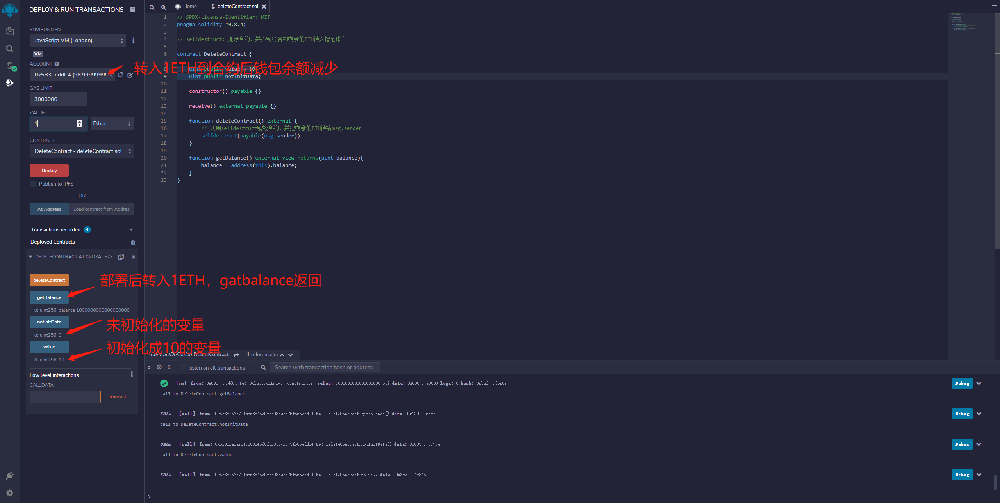

# WTF Solidity极简入门: 26. 删除合约

我最近在重新学solidity，巩固一下细节，也写一个“WTF Solidity极简入门”，供小白们使用（编程大佬可以另找教程），每周更新1-3讲。

欢迎关注我的推特：[@0xAA_Science](https://twitter.com/0xAA_Science)

欢迎加入WTF科学家社区，内有加微信群方法：[链接](https://discord.gg/5akcruXrsk)

所有代码和教程开源在github（1024个star发课程认证，2048个star发社群NFT）: [github.com/AmazingAng/WTFSolidity](https://github.com/AmazingAng/WTFSolidity)

-----

## `selfdestruct`

`selfdestruct`命令可以用来删除智能合约，并将该合约剩余`ETH`转到指定地址。`selfdestruct`是为了应对合约出错的极端情况而设计的。它最早被命名为`suicide`（自杀），但是这个词太敏感。为了保护抑郁的程序员，改名为`selfdestruct`；在 [v0.8.18](https://blog.soliditylang.org/2023/02/01/solidity-0.8.18-release-announcement/) 版本中，`selfdestruct` 关键字被标记为「不再建议使用」，在一些情况下它会导致预期之外的合约语义，但由于目前还没有代替方案，目前只是对开发者做了编译阶段的警告，相关内容可以查看 [EIP-6049](https://eips.ethereum.org/EIPS/eip-6049)。

### 如何使用`selfdestruct`
`selfdestruct`使用起来非常简单：
```solidity
selfdestruct(_addr)；
```
其中`_addr`是接收合约中剩余`ETH`的地址。

### 例子
```solidity
contract DeleteContract {

    uint public value = 10;

    constructor() payable {}

    receive() external payable {}

    function deleteContract() external {
        // 调用selfdestruct销毁合约，并把剩余的ETH转给msg.sender
        selfdestruct(payable(msg.sender));
    }

    function getBalance() external view returns(uint balance){
        balance = address(this).balance;
    }
}
```
在`DeleteContract`合约中，我们写了一个`public`状态变量`value`，两个函数：`getBalance()`用于获取合约`ETH`余额，`deleteContract()`用于自毁合约，并把`ETH`转入给发起人。

部署好合约后，我们向`DeleteContract`合约转入1 `ETH`。这时，`getBalance()`会返回1 `ETH`，`value`变量是10。

当我们调用`deleteContract()`函数，合约将自毁，所有变量都清空，此时`value`变为默认值`0`，`getBalance()`也返回空值。

### 注意事项
1. 对外提供合约销毁接口时，最好设置为只有合约所有者可以调用，可以使用函数修饰符`onlyOwner`进行函数声明。

2. 当合约被销毁后与智能合约的交互也能成功，并且返回0。

3. 当合约中有`selfdestruct`功能时常常会带来安全问题和信任问题，合约中的Selfdestruct功能会为攻击者打开攻击向量(例如使用`selfdestruct`向一个合约频繁转入token进行攻击，这将大大节省了GAS的费用，虽然很少人这么做)，此外，此功能还会降低用户对合约的信心。

###  在remix上验证
1. 部署合约并且转入1ETH，查看合约状态



2. 销毁合约，查看合约状态


从测试中观察合约状态可以发现合约销毁后的ETH返回给了指定的地址，并且在合约销毁后依然可以请求交互，所以我们不能根据这个来判断合约是否已经销毁。


## 总结

`selfdestruct`是智能合约的紧急按钮，销毁合约并将剩余`ETH`转移到指定账户。当著名的`The DAO`攻击发生时，以太坊的创始人们一定后悔过没有在合约里加入`selfdestruct`来停止黑客的攻击吧。
